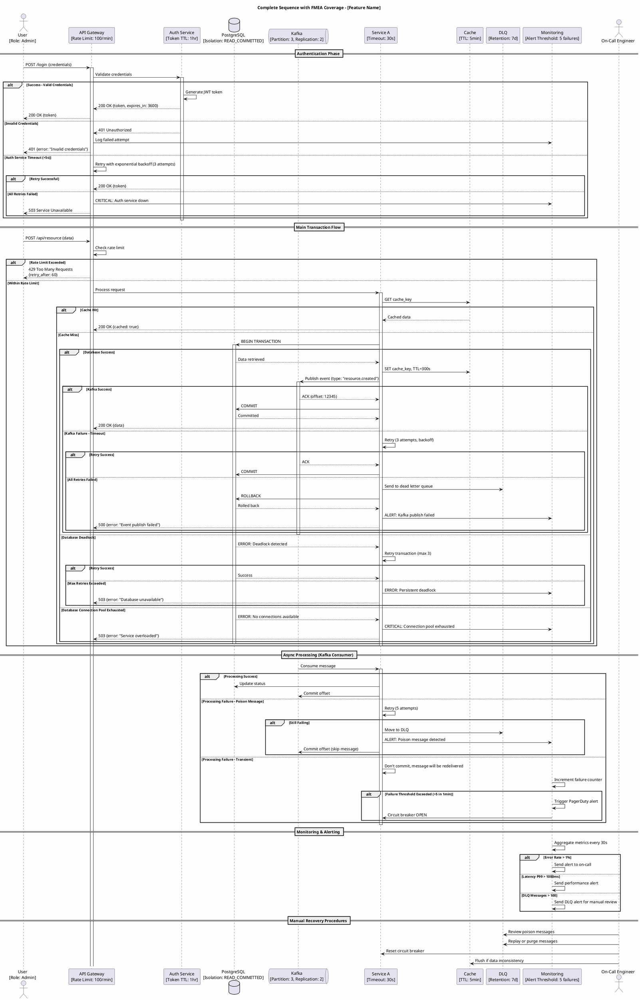

# Instructions for Claude AI Assistant

## Project Overview
Axiom Loom Catalog is a comprehensive developer portal showcasing repositories, APIs, and documentation. Architecture Packages and Complete Solutions Built By Axiom Loom AI Agents!

## Critical Build and Deployment Requirements

### NEVER Deploy Without Validation
**CORE PRINCIPLE: NO DEPLOYMENT WITHOUT SUCCESSFUL BUILD VALIDATION**

Before ANY deployment:
1. Run `./scripts/validate-build.sh` - MUST pass
2. Fix ALL TypeScript errors - Zero tolerance
3. Fix ALL ESLint errors - Zero tolerance  
4. Ensure ALL tests pass - 100% required
5. Manually test in browser - No console errors allowed

### Build Validation Checklist
- [ ] `npm run type-check` - 0 errors
- [ ] `npm run lint` - 0 errors
- [ ] `npm run build` - Completes successfully
- [ ] `npm run test:ci` - All tests pass
- [ ] Manual UI testing - No errors

## Critical Testing Requirements

### Mandatory Regression Testing Before Every Deployment
**CORE PRINCIPLE: EVERY CODE CHANGE MUST PASS FULL REGRESSION SUITE**

Before ANY deployment or restart:
1. Run the full test suite: `npm test`
2. Run E2E tests: `npm run test:e2e`
3. Manually test all critical user flows
4. Verify all API endpoints return 200 status
5. Check browser console for any errors

### Required Test Coverage for New Features
When adding ANY new feature:
1. **Component Tests**: Test that components render correctly
2. **Navigation Tests**: Test all links and navigation paths
3. **API Tests**: Test all new API endpoints
4. **Integration Tests**: Test component + API interactions
5. **E2E Tests**: Test complete user flows

### Critical Areas That MUST Be Tested
1. **All Navigation Links**: Every link must be tested to ensure no 404s
2. **API Endpoints**: Every endpoint must have unit and integration tests
3. **Route Definitions**: Every route must be tested for proper rendering
4. **Error Scenarios**: Test what happens when APIs fail
5. **Query Parameters**: Test all URL parameter variations

### 100% Document and Link Coverage
**CORE PRINCIPLE: WE TEST EVERY DOCUMENT IN EVERY REPO FOR CONTENT AND WE TEST EVERY LINK IN EVERY DOCUMENT AND THEN WE TEST THE DOCUMENTS AND ITS CONTENT APPEAR WHEN THE LINK IS CLICKED**

When implementing features or fixing bugs:
1. Always ensure document links work correctly
2. Test navigation between markdown files
3. Verify external links open in new tabs
4. Ensure internal links navigate within the app
5. Test that clicking links loads the correct content

### Performance Requirements
- Use local-first caching for repositories
- Only sync on user request (not on load)
- Optimize all API calls
- Implement lazy loading for components

### UI/UX Requirements
- All repositories with Postman collections must show Postman button
- GraphQL repositories must have working playground links
- Marketing descriptions must be human-friendly (no markdown syntax)
- Repository detail pages must show business value and categorizations
- Document navigation must support relative links

### Code Quality Standards
- Fix all TypeScript compilation errors before claiming completion
- Run build and ensure no errors
- Test all features manually
- Use proper error handling
- Follow existing code patterns

### Testing Approach - MANDATORY FOR FRONTEND UIs
**CORE PRINCIPLE: NO SUCCESS WITHOUT FULL REGRESSION SUITE**

For ANY project with frontend UIs, you MUST NOT finish or declare success until:

1. **Content Testing**: Verify all text, images, and components render correctly
2. **Click-through User Experience**: Test every button, link, form, and navigation
3. **Backend Integration**: Verify all API calls, data flow, and error handling
4. **Link Validation**: Test every internal and external link works correctly  
5. **Full Regression Suite**: Run complete end-to-end tests that simulate real users

**DEPLOYMENT PIPELINE REQUIREMENTS:**
- Unit tests for utility functions
- Integration tests for API endpoints  
- E2E tests with Playwright for user journeys
- Automated click-through testing of ALL UI elements
- Link validation for all documents
- Backend API integration verification
- Error boundary and error handling validation
- Performance and load testing
- Cross-browser compatibility testing

**YOU WILL NOT DECLARE SUCCESS OR FINISH UNTIL:**
- Real browser tests pass showing actual user experience
- Every UI element has been clicked and verified
- Every API endpoint has been tested end-to-end  
- Error scenarios have been tested and verified
- Users can complete full workflows without issues

### Key Features to Maintain
1. Repository browsing with marketing descriptions
2. API detection (OpenAPI, GraphQL, gRPC)
3. Postman collection discovery
4. Document viewer with link navigation
5. Search functionality
6. Sync on demand (not automatic)
7. Local caching for performance

## Sequence Diagram Requirements for FMEA-Ready Documentation

### CORE PRINCIPLE: COMPREHENSIVE SEQUENCE DIAGRAMS FOR FAILURE MODE ANALYSIS

When creating sequence diagrams, you MUST generate PlantUML diagrams that are detailed enough to conduct a complete Failure Mode and Effects Analysis (FMEA). Every diagram must include:

### Required Elements for ALL Sequence Diagrams

1. **All User Roles and Actors**
   - End Users (with permission levels)
   - Administrators
   - Service Accounts
   - External Systems
   - Monitoring/Alerting Systems
   - Background Jobs/Schedulers

2. **Complete Flow Coverage**
   - Happy path (primary success scenario)
   - ALL alternative paths
   - ALL error scenarios
   - Timeout conditions
   - Retry mechanisms
   - Circuit breaker patterns
   - Fallback behaviors
   - Compensation transactions

3. **Integration Points**
   - REST API calls (with HTTP methods, status codes)
   - Kafka/EventHub interactions (produce, consume, commit)
   - Database transactions (with isolation levels)
   - Cache interactions (hit, miss, invalidation)
   - Authentication/Authorization checks
   - Rate limiting/throttling
   - Message queue operations

4. **Error Recovery Mechanisms**
   - Retry policies (exponential backoff, max attempts)
   - Dead letter queues
   - Poison message handling
   - Transaction rollback scenarios
   - Compensating transactions
   - Manual intervention points
   - Alert triggers

5. **Edge Cases and Boundary Conditions**
   - Concurrent access scenarios
   - Race conditions
   - Network partitions
   - Service unavailability
   - Data inconsistency handling
   - Version mismatch scenarios
   - Resource exhaustion (memory, connections)
   - Security breach attempts

### PlantUML Template Structure

### Required Annotations for FMEA

Each sequence diagram MUST include:

1. **Timing Constraints**
   - Timeouts for each call
   - SLA requirements
   - Performance thresholds

2. **Failure Probabilities**
   - Historical failure rates
   - MTBF (Mean Time Between Failures)
   - MTTR (Mean Time To Recovery)

3. **Impact Severity**
   - Data loss potential
   - User impact scope
   - Business continuity effects

4. **Detection Methods**
   - Monitoring points
   - Alert thresholds
   - Health check endpoints

5. **Mitigation Strategies**
   - Automated recovery
   - Manual procedures
   - Escalation paths

### Kafka-Specific Requirements

For Kafka/EventHub interactions, always include:
- Partition strategy
- Replication factor
- Consumer group management
- Offset management (at-least-once, exactly-once)
- Rebalancing scenarios
- Schema evolution handling
- Backpressure management

### REST API Specific Requirements

For REST APIs, always include:
- All HTTP status codes
- Request/response headers
- Authentication headers
- Idempotency keys
- Correlation IDs for tracing
- Rate limiting headers
- CORS handling

### Validation Checklist for Sequence Diagrams

Before considering a sequence diagram complete:
- [ ] All user roles are represented
- [ ] Every API call has timeout handling
- [ ] Every database operation has transaction boundaries
- [ ] Every Kafka operation has offset management
- [ ] All failure modes have recovery paths
- [ ] Monitoring points are identified
- [ ] Manual intervention procedures are documented
- [ ] Security checks are explicit
- [ ] Performance bottlenecks are annotated
- [ ] Data consistency guarantees are clear

## Remember
- Test everything before claiming it works
- No broken links, ever
- Performance matters - cache aggressively
- User experience is paramount
- Sequence diagrams must be FMEA-ready with complete failure analysis