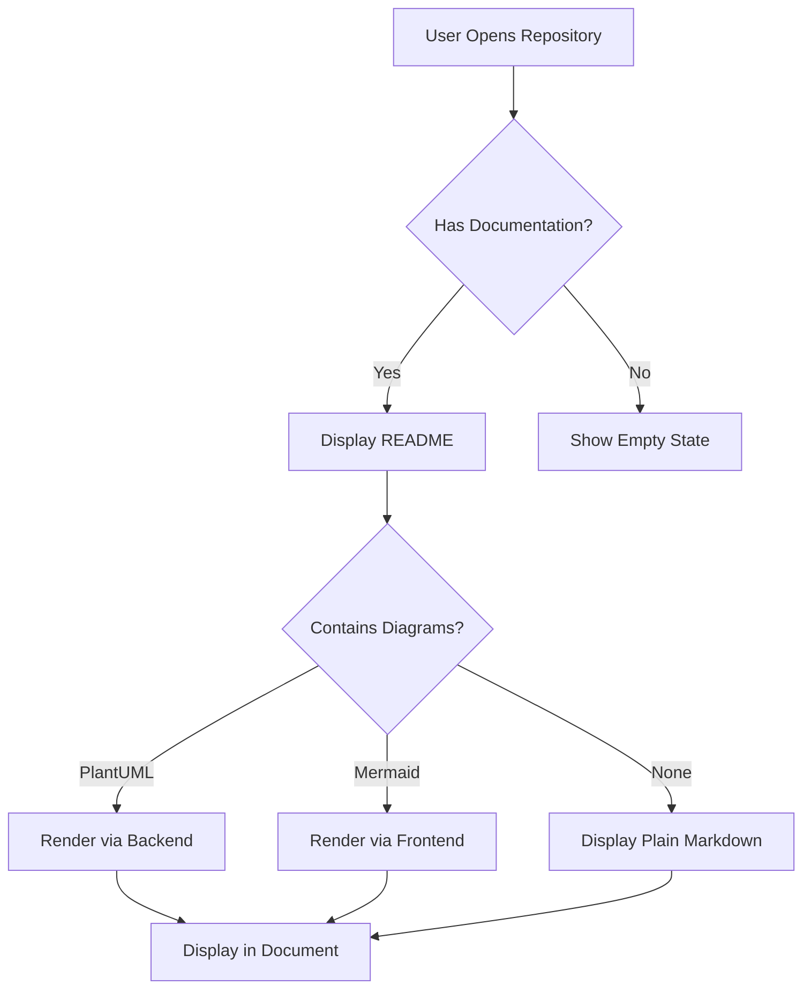
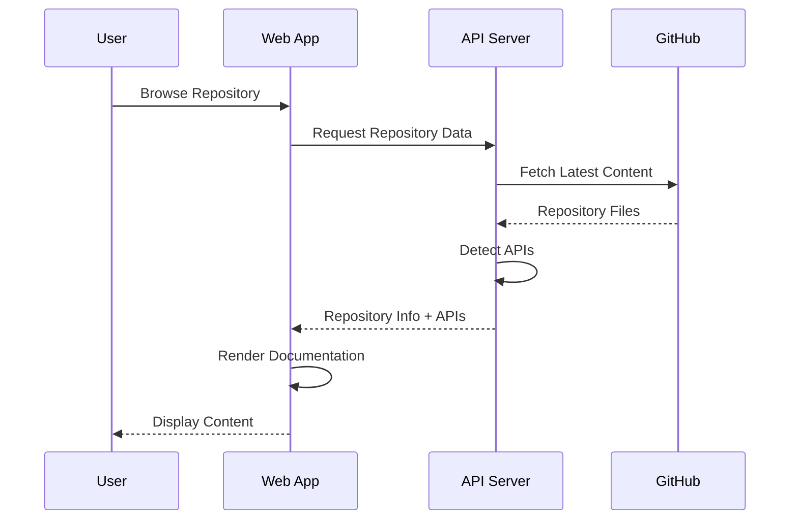
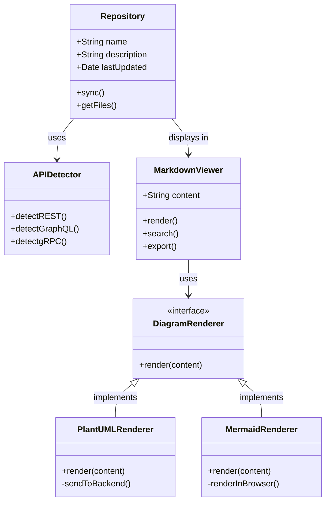
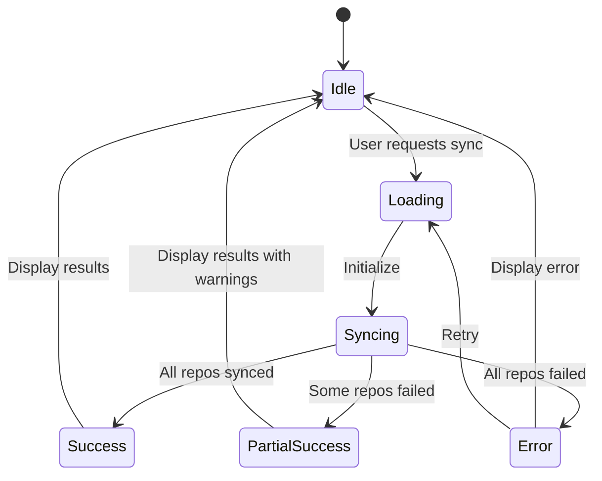
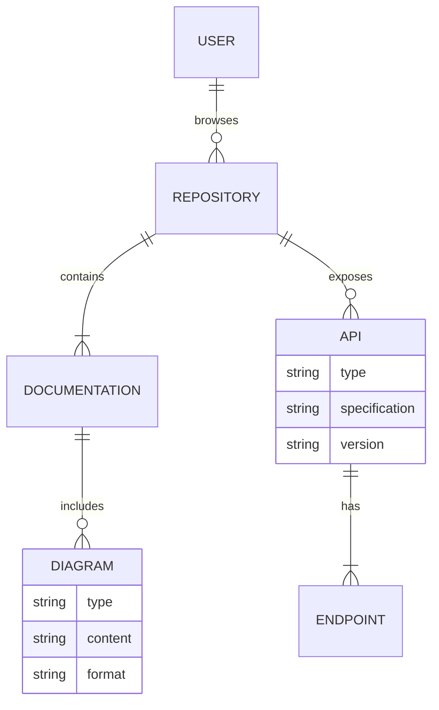
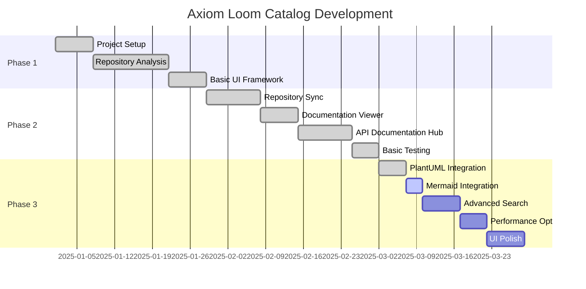
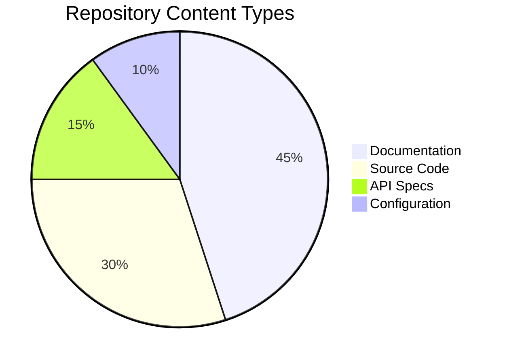
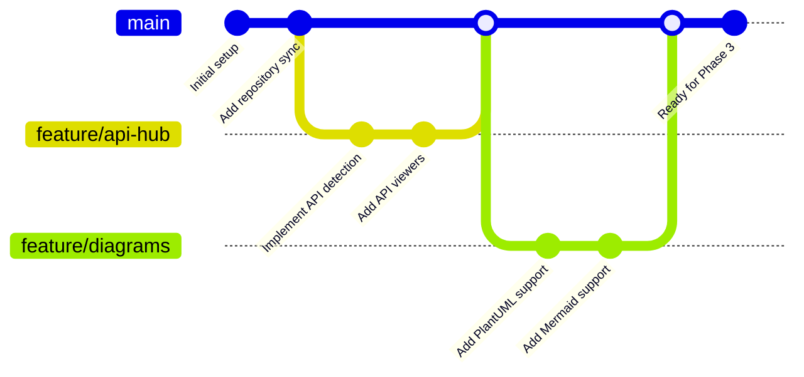
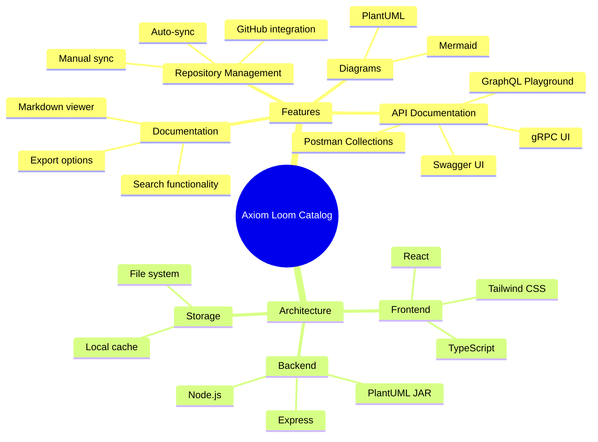
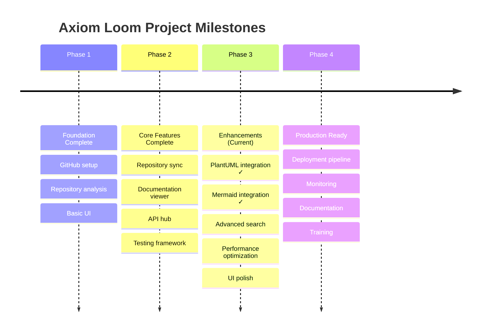

# Mermaid Diagram Examples

This document demonstrates the Mermaid diagram integration in the Axiom Loom Catalog.

## Flowchart



## Sequence Diagram



## Class Diagram



## State Diagram



## Entity Relationship Diagram



## Gantt Chart



## Pie Chart



## Git Graph



## Mind Map



## Timeline



## Tips for Using Mermaid

1. **Syntax**: Mermaid diagrams are automatically detected in ` ```mermaid ` code blocks
2. **Types**: Supports flowcharts, sequence diagrams, class diagrams, state diagrams, ER diagrams, Gantt charts, pie charts, git graphs, mind maps, and timelines
3. **Rendering**: Diagrams render directly in the browser - no backend required
4. **Themes**: Supports multiple themes (default, dark, forest, neutral)
5. **Export**: Diagrams can be downloaded as SVG files
6. **Performance**: Mermaid diagrams render quickly without server round-trips